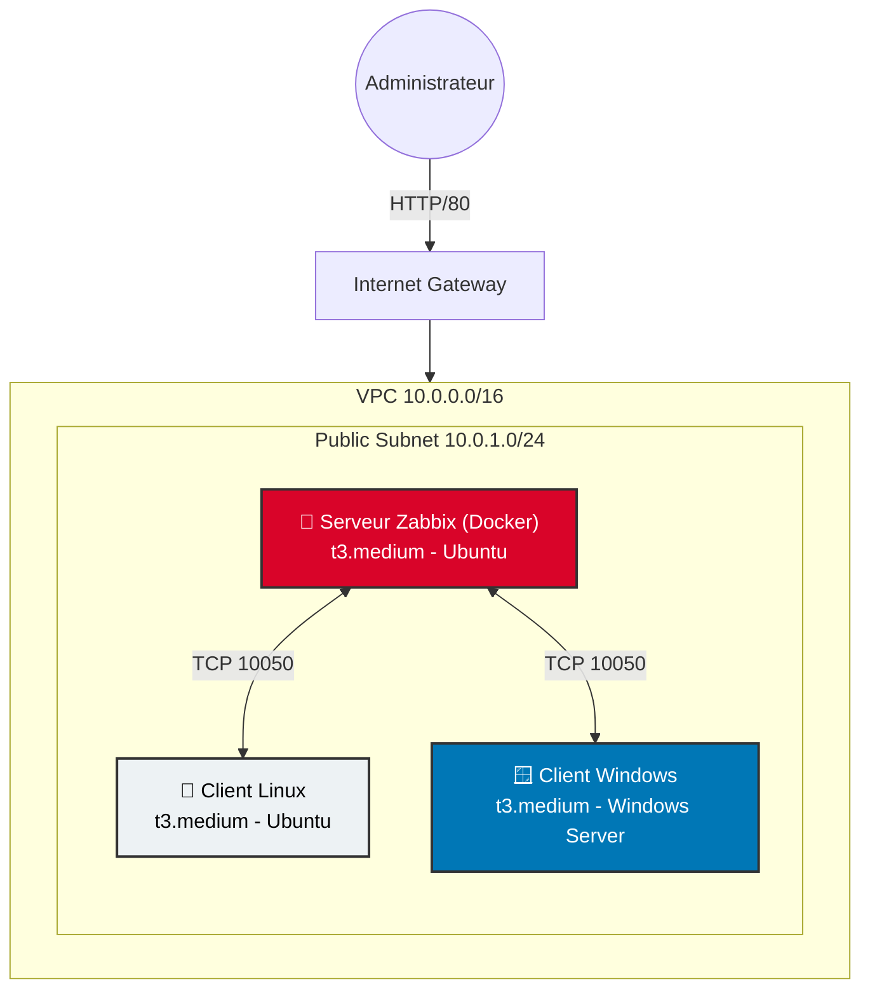
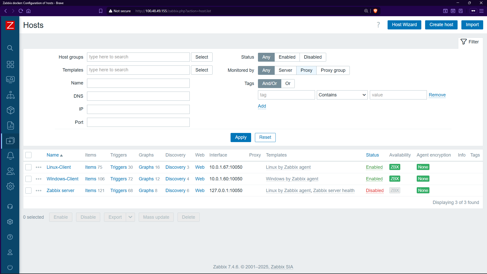

# ☁️ Infrastructure de Supervision Cloud Hybride (AWS + Zabbix)


## 📋 Présentation du Projet
Ce projet implémente une **infrastructure de supervision centralisée** hébergée sur **AWS**.  L'objectif est de monitorer un parc informatique hybride (serveurs Linux et Windows) en utilisant **Zabbix** déployé via **Docker**.

Ce dépôt contient les scripts de configuration, les fichiers Docker-Compose et la documentation technique nécessaire au déploiement. 

### 🎯 Objectifs
* Déployer un **VPC** sécurisé sur AWS.
* Installer **Zabbix Server** via conteneurs Docker (Isolation & Portabilité).
* Configurer des **Agents Zabbix** sur des instances **Ubuntu** et **Windows Server**.
* Visualiser les métriques (CPU, RAM, Disponibilité) en temps réel.

---

## 🏗️ Architecture Technique

Le schéma ci-dessous illustre l'architecture réseau déployée dans la région `us-east-1` :



---

## 🛠️ Prérequis
* Un compte **AWS Academy** (Learner Lab) ou **AWS Standard**.
* Un client SSH (Terminal, Putty) et un client RDP.
* La clé privée `.pem` générée lors de la création des instances.

---

## 🚀 Guide de Déploiement

### 1. Configuration AWS (Infrastructure)
| Composant | Valeur |
|-----------|--------|
| **VPC** | `10.0.0.0/16` |
| **Subnet Public** | `10.0.1.0/24` (Auto-assign Public IP: Enabled) |

**Security Groups :**
| Nom | Ports Entrants |
|-----|----------------|
| `Zabbix-Server-SG` | 80, 443, 10051, 10050, 22 |
| `Zabbix-Agents-SG` | 10050, 22, 3389 |

### 2. Installation du Serveur (Docker)
Connectez-vous en SSH à l'instance Serveur Zabbix et exécutez : 

```bash
# Installation de Docker
sudo apt update
sudo apt install -y docker.io docker-compose-v2
sudo usermod -aG docker $USER

# Déploiement de Zabbix
mkdir zabbix-docker && cd zabbix-docker
nano docker-compose.yml
# (Copier le fichier docker-compose.yml fourni dans ce dépôt)
docker compose up -d
```

### 3. Configuration des Agents

#### 🐧 Client Linux (Ubuntu)
```bash
wget https://repo.zabbix.com/zabbix/7.0/ubuntu/pool/main/z/zabbix-release/zabbix-release_7.0-2+ubuntu24.04_all.deb
sudo dpkg -i zabbix-release_7.0-2+ubuntu24.04_all.deb
sudo apt update
sudo apt install zabbix-agent
sudo nano /etc/zabbix/zabbix_agentd.conf
# Modifier : Server=<IP_PRIVEE_SERVEUR_ZABBIX>
sudo systemctl restart zabbix-agent
```

#### 🪟 Client Windows
1. Télécharger l'installateur MSI **Zabbix Agent** (Version 7.0 LTS).
2. Lors de l'installation, entrer l'**IP Privée** du Serveur Zabbix.
3. Autoriser le port **10050** dans le Pare-feu Windows.
```bash
New-NetFirewallRule -DisplayName "Allow Zabbix" -Direction Inbound -LocalPort 10050 -Protocol TCP -Action Allow
```

---

## 📸 Aperçu du Monitoring

### 1. Interface de Connexion
* Accès via `http://<IP_PUBLIQUE_EC2>`
* **User:** `Admin`
* **Password:** `zabbix`

### 2. Statut des Hôtes

*Les agents Linux et Windows remontent les données correctement (Indicateur **ZBX Vert**).*

---

## 👤 Auteur
**Zakaria BOUZOUBA**

Étudiant en Génie Informatique (2ème Année)

Projet réalisé dans le cadre du module *Ingénierie des Infrastructures Cloud*.

> Encadré par : **Prof. Azeddine KHIAT**
